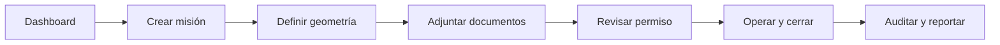
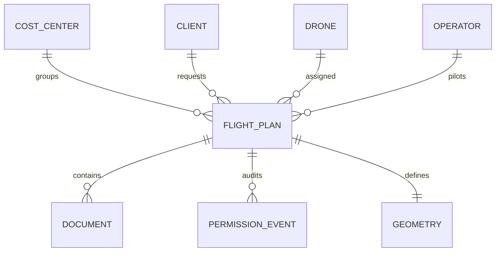

# AeroFlow

**Plataforma para operaciones RPA/drones, trazabilidad geoespacial y gestión documental.**

AeroFlow centraliza planificación de misiones, geometría, permisos DGAC/SIGO, documentos y reportes en un flujo claro y auditable.

[](https://www.typescriptlang.org/)
[](https://nextjs.org/)
[](https://www.prisma.io/)
[](https://www.sqlite.org/)
[](https://maplibre.org/)

---

## Qué resuelve

Hoy, una operación con drones suele quedar repartida entre planillas, correos, PDFs y archivos geográficos. AeroFlow ordena ese trabajo en una sola experiencia:

- misión
- mapa
- documentos
- permisos
- trazabilidad
- reportes

---

## Flujo operativo



---

## Esquema del producto



---

## Capacidades clave

| Área | Valor |
|---|---|
| Dashboard | Visión operativa de lo urgente |
| Planes de vuelo | Creación y seguimiento de misiones |
| Mapa | Geometría interactiva y visual |
| Permisos | Estados, checklist y trazabilidad |
| Documentos | Evidencia y respaldo por misión |
| Reportes | Exportación y entrega técnica |

---

## Stack

| Capa | Tecnología |
|---|---|
| Frontend | Next.js 15, React 19, TypeScript |
| UI | Tailwind CSS 3 |
| Backend | Next.js server actions y route handlers |
| Datos | Prisma 6, SQLite en desarrollo |
| Mapas | MapLibre + TerraDraw |
| Tests | Vitest |

---

## Inicio simple

```powershell
git clone https://github.com/DovaCrii/Geo-Registros.git
cd Geo-Registros
npm install
npm run dev
```

Abrí la app en `http://localhost:3000`.

---

## Documentación esencial

- `AGENTS.md` — contrato operativo
- `DECISIONS.md` — decisiones estables
- `KNOWN_BUGS.md` — riesgos abiertos

---

## Licencia

Licencia comercial. Ver [`LICENSE`](LICENSE).

Copyright © 2026 Cristobal Munoz.
