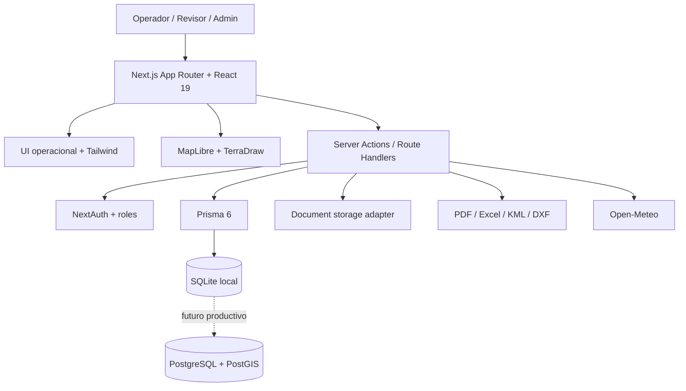
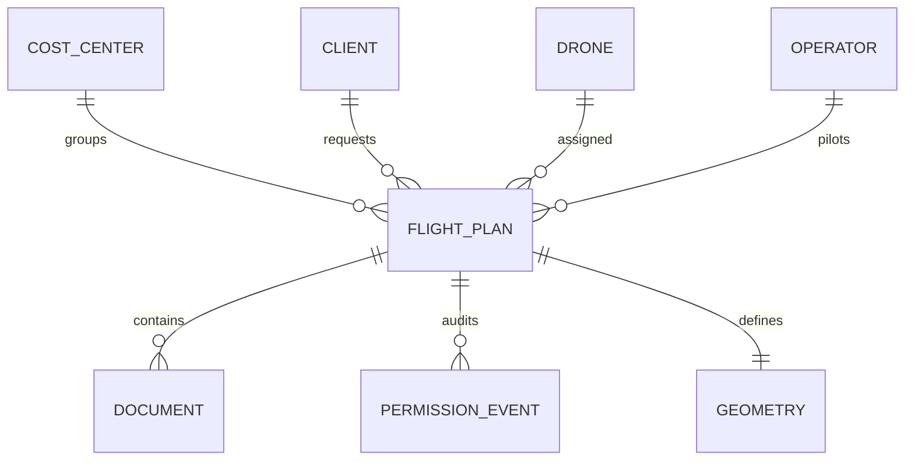

<div align="center">

# AeroFlow / Geo-Registros

**Centro operativo para vuelos RPA/drones, geometría, permisos DGAC/SIGO, documentos técnicos y trazabilidad.**

Plataforma full-stack para convertir una operación de dron dispersa en un flujo auditable: planificar, dibujar zona, asociar equipo, preparar documentación, revisar permiso, volar, cerrar y reportar.

[](https://www.typescriptlang.org/)
[](https://nextjs.org/)
[](https://react.dev/)
[](https://www.prisma.io/)
[](https://maplibre.org/)
[](https://vitest.dev/)
[](LICENSE)

</div>

---

## En una frase

**AeroFlow ayuda a equipos de ingeniería, topografía, minería, infraestructura y operaciones RPA a gestionar vuelos con drones desde un panel único, con mapa, permisos, documentos, checklist y evidencia técnica conectados al mismo plan de vuelo.**

---

## Por qué existe

Las operaciones con drones suelen vivir repartidas entre planillas, correos, PDFs, archivos KML/KMZ, carpetas compartidas y conversaciones sueltas. Eso dificulta responder preguntas básicas:

- ¿Qué vuelo está listo para operar?
- ¿Qué permiso, documento o evidencia falta?
- ¿Dónde está exactamente la geometría aprobada?
- ¿Quién cambió el estado y cuándo?
- ¿Qué se debe reportar al cerrar la misión?

**AeroFlow ordena ese caos en un workflow operativo y trazable.**

---

## Flujo operacional


El producto prioriza una experiencia **mapa-first**: la geometría y el estado operacional deben ser fáciles de entender antes que editar campos técnicos.

---

## Capacidades principales

| Área | Qué entrega | Valor operativo |
|---|---|---|
| **Panel operativo** | KPIs, próximos vuelos, documentos pendientes, vencimientos y estados | Saber qué atender ahora |
| **Planes de vuelo** | Creación, edición, asignación de cliente/dron/operador y estado | Centralizar la misión |
| **Mapa y geometría** | MapLibre + TerraDraw para puntos, líneas y polígonos | Definir zona operacional visualmente |
| **Permisos DGAC/SIGO** | Estados, historial, checklist y documentación relacionada | Reducir riesgo regulatorio |
| **Documentos por misión** | Adjuntos, evidencias, permisos, seguros, checklists y bitácoras | Mantener respaldo auditable |
| **Trazabilidad** | Timeline de eventos, cambios de estado y registros asociados | Auditar quién hizo qué y cuándo |
| **Reportes** | Exportación PDF/Excel y paquetes técnicos | Entregar evidencia clara al cliente |
| **Centro de conocimiento** | Ayuda DGAC, flujo guiado y referencias normativas | Bajar fricción para usuarios nuevos |

---

## Arquitectura técnica



### Modelo de dominio simplificado



---

## Stack

| Capa | Tecnología |
|---|---|
| Frontend | Next.js 15, React 19, TypeScript |
| UI | Tailwind CSS 3, componentes propios, enfoque light-first |
| Backend | Server Actions, Route Handlers, NextAuth |
| Datos | Prisma 6, SQLite local, PostgreSQL/PostGIS planificado |
| Mapas | MapLibre GL JS, TerraDraw |
| Geo formatos | GeoJSON interno, KML/DXF import/export |
| Reportes | PDFKit, XLSX |
| Testing | Vitest, Testing Library, jsdom |
| Integraciones | Open-Meteo, Resend |

---

## Estado del producto

| Bloque | Estado | Nota |
|---|---|---|
| Base full-stack | ✅ Implementado | Next.js, TypeScript, Prisma, Tailwind |
| Datos maestros | ✅ Implementado | Clientes, drones, operadores y centros de costo |
| Planes de vuelo | ✅ Implementado | Flujo operativo y relaciones principales |
| Permisos / DGAC | ✅ Implementado | Checklist, historial, documentos y estados |
| Dashboard comercial | ✅ En evolución | Base operativa lista; sigue polish visual |
| Mapa operacional | 🚧 Prioridad actual | Workspace mapa-first, capas y herramientas |
| Roles avanzados | 🚧 Próximo | Revisor, auditor, permisos por rol |
| UX premium | 🚧 Continuo | Menos CRUD, más operación guiada |

Ver el estado completo en [`documentacion/PROJECT_STATUS.md`](documentacion/PROJECT_STATUS.md) y la ruta de avance en [`documentacion/ROADMAP.md`](documentacion/ROADMAP.md).

---

## Estructura del repositorio

```
📁 Geo-Registros/
 ├── 📁 apps/web/              ← 🌐 App Next.js (frontend + backend)
 │     ├── src/app/            ←    Páginas y rutas
 │     ├── src/components/     ←    Componentes reutilizables
 │     ├── src/modules/        ←    Lógica de negocio
 │     ├── src/server/         ←    Server Actions + queries
 │     └── src/lib/            ←    Utilidades
 ├── 📁 backend/               ← 🗄️ Datos y almacenamiento
 │     ├── prisma/             ←    Schema, migraciones, seed
 │     └── storage/            ←    Archivos locales
 ├── 📁 documentacion/         ← 📚 Documentación del proyecto
 ├── 📁 tooling/               ← 🤖 Skills y herramientas IA
 ├── 📄 package.json           ← ⚡ Comandos de entrada
 ├── 📄 AGENTS.md              ← 📋 Guía para agentes IA
 └── 📄 README.md              ← 🏠 Este archivo
```

### Guía rápida
1. Abrí la carpeta `Geo-Registros` en VS Code.
2. Ejecutá `npm run dev` en la terminal integrada.
3. Abrí `http://localhost:3000`.
4. Si necesitás preparar datos locales, corré `npm run prisma:generate`, `npm run prisma:migrate` y `npm run seed:dev`.
5. La app vive en `apps/web/`; la raíz queda como comando de entrada.

---

## Quick start

```powershell
git clone https://github.com/DovaCrii/Geo-Registros.git
cd Geo-Registros

cp .env.example .env

npm install
npm run prisma:generate
npm run prisma:migrate
npm run seed:dev
npm run dev
```

Abrí la app en:

```text
http://localhost:3000
```

### Demo local

Para cargar datos de ejemplo:

```powershell
# En .env
SEED_DEMO=true

# Luego
npm run seed:dev
```

Credenciales demo:

```text
demo@aeroflow.io
demo1234
```

---

## Comandos útiles

| Comando | Uso |
|---|---|
| `npm run dev` | Servidor local |
| `npm run build` | Build de producción |
| `npm run start` | Ejecutar build |
| `npm run typecheck` | Typegen + TypeScript |
| `npm run test` | Suite Vitest |
| `npm run test:watch` | Tests en modo watch |
| `npm run prisma:generate` | Generar cliente Prisma |
| `npm run prisma:migrate` | Migraciones locales |
| `npm run seed:dev` | Seed de desarrollo/demo |

---

## Calidad esperada

Antes de considerar una tarea cerrada:

```powershell
npm run typecheck
npm run test
npm run build
```

Para cambios visuales, además revisar manualmente:

- home / landing;
- login;
- dashboard;
- creación de plan de vuelo;
- detalle del plan;
- editor de geometría;
- responsive desktop/mobile.

---

## Roadmap inmediato

1. **Mapa-first workspace:** mapa amplio, toolbar clara, panel lateral y guardado visible.
2. **Capas tipo Google Earth:** base/satélite, geometría activa, áreas guardadas y referencias.
3. **Creación de misión más directa:** eliminar GeoJSON visible del flujo normal.
4. **Dashboard más comercial:** siguiente acción, riesgos y pendientes priorizados.
5. **Roles y revisión:** separar operador, revisor, admin y auditor.
6. **Trazabilidad documental:** mejorar evidencia, auditoría y cierre de vuelo.

---

## Documentación recomendada

| Documento | Para qué sirve |
|---|---|
| [`documentacion/PROJECT_STATUS.md`](documentacion/PROJECT_STATUS.md) | Estado ejecutivo del producto |
| [`documentacion/PROJECT_STATE.md`](documentacion/PROJECT_STATE.md) | Estado técnico resumido del proyecto |
| [`documentacion/ROADMAP.md`](documentacion/ROADMAP.md) | Fases y prioridades |
| [`documentacion/TASKS.md`](documentacion/TASKS.md) | Tareas pequeñas y verificables |
| [`documentacion/OPENCODE_HANDOFF.md`](documentacion/OPENCODE_HANDOFF.md) | Próximo handoff operativo |
| [`documentacion/ESTRUCTURA_REPOSITORIO.md`](documentacion/ESTRUCTURA_REPOSITORIO.md) | Organización del repo |

---

## Enfoque de producto

AeroFlow toma principios de plataformas profesionales como centros operativos, planificadores de misión y herramientas geoespaciales modernas:

- claridad antes que complejidad;
- mapa como superficie central;
- estados visibles;
- checklist operacional;
- trazabilidad auditable;
- documentación lista para cliente y regulación.

No busca copiar una interfaz existente: busca construir una experiencia propia, profesional, clara y comercialmente competitiva para operaciones RPA.

---

## Licencia

Licencia comercial. Ver [`LICENSE`](LICENSE).

Copyright © 2026 Cristobal Muñoz.

<p align="center"><sub>Built with Next.js, TypeScript, Prisma, MapLibre and operational discipline.</sub></p>
