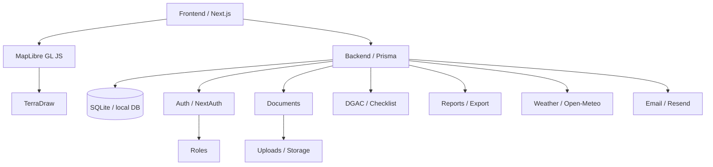

# AeroFlow Architecture Diagram

- Diagram type: flowchart
- Mermaid file: `diagrams\aeroflow-architecture.mmd`
- SVG: not generated

## Explanation

This diagram illustrates the core components and their interactions within the AeroFlow platform. The frontend is built with Next.js. The backend uses Prisma to access a local SQLite database. MapLibre GL JS and TerraDraw support map editing. Auth, documents, DGAC checklist, exports, weather, and email are treated as backend-facing services.

## Mermaid

