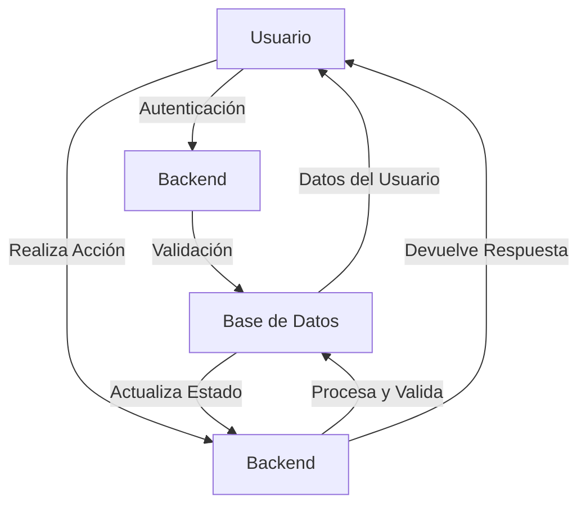

# Diagrama de Prueba Simple con Usuario y Backend

- Diagram type: flowchart
- Mermaid file: `diagrams\prueba-simple-user-backend.mmd`
- SVG: not generated

## Explanation

Este diagrama muestra un flujo básico de interacción entre el usuario, el backend y la base de datos. El usuario realiza una acción que es procesada por el backend, que a su vez interactúa con la base de datos para obtener o actualizar información.

## Mermaid

