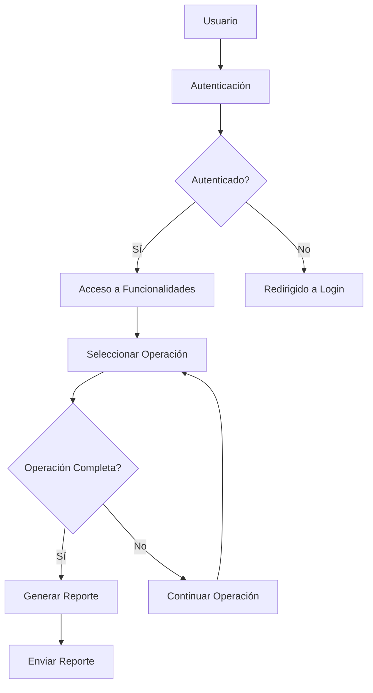

# Diagrama de Prueba Simple con Usuario y Backend

- Diagram type: flowchart
- Mermaid file: `diagrams\simple-test-diagram.mmd`
- SVG: not generated

## Explanation

Este diagrama muestra un flujo básico de prueba para una aplicación con usuario y backend. Comienza con el usuario intentando acceder a la plataforma, que luego se autentica. Si la autenticación es exitosa, el usuario puede seleccionar operaciones hasta completarlas, momento en el cual se genera un reporte. El diagrama ilustra la navegación entre diferentes estados y acciones dentro de la aplicación.

## Mermaid

