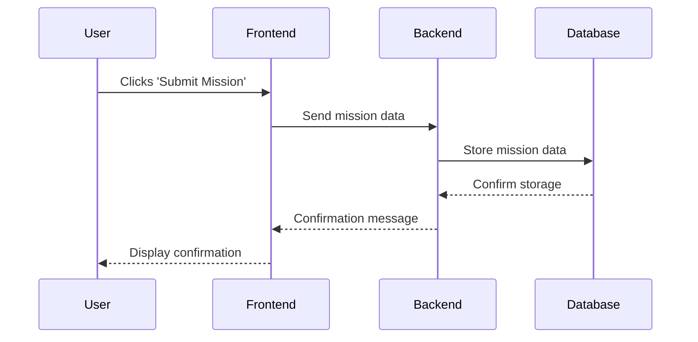

# User and Backend Interaction Diagram

- Diagram type: sequenceDiagram
- Mermaid file: `diagrams\user-backend-interaction.mmd`
- SVG: not generated

## Explanation

This diagram illustrates the interaction between a user, frontend application, backend server, and database when submitting a mission. The user initiates the process by clicking 'Submit Mission', which triggers a sequence of events where the data is sent to the backend, stored in the database, and then confirmed back to the user.

## Mermaid

